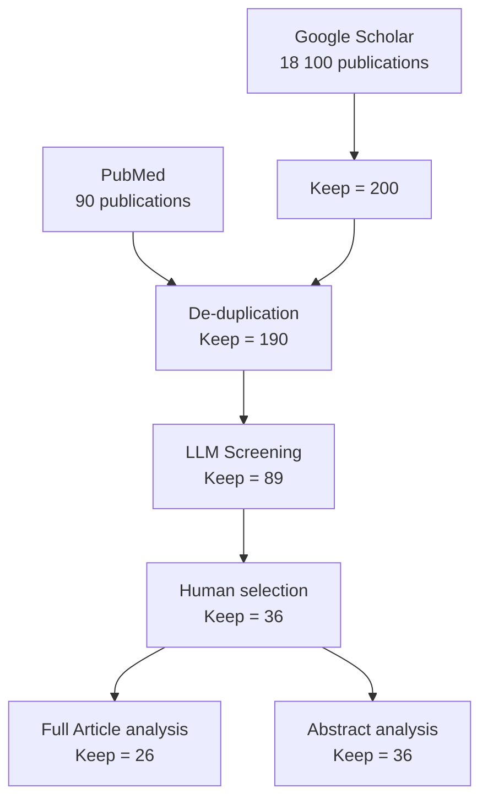
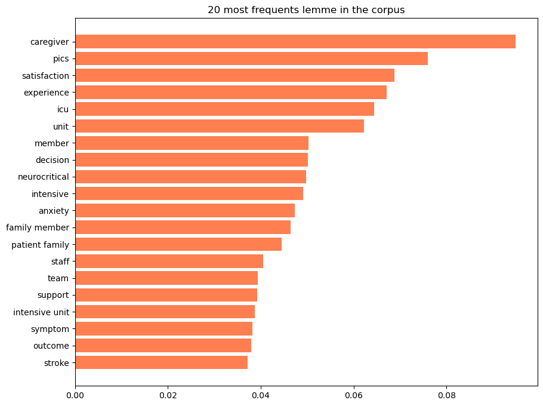
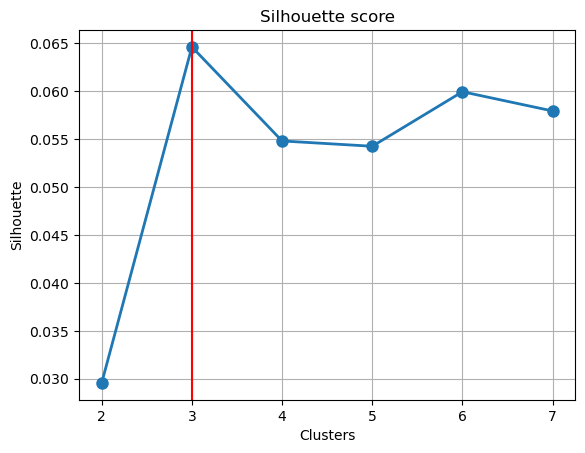
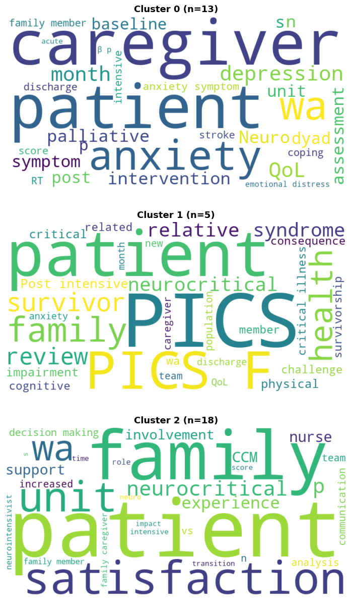
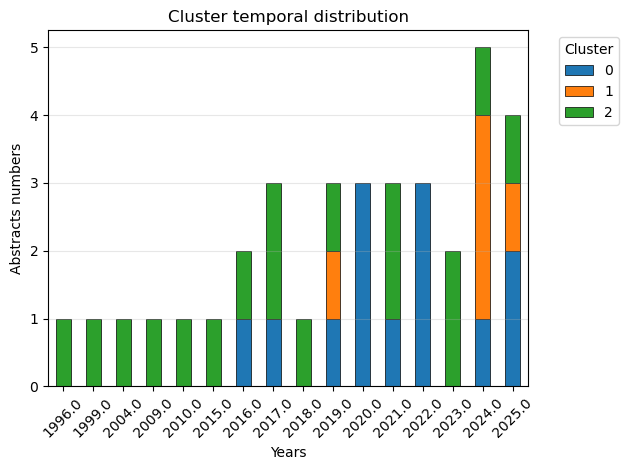
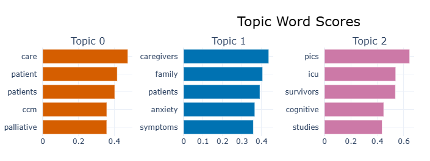
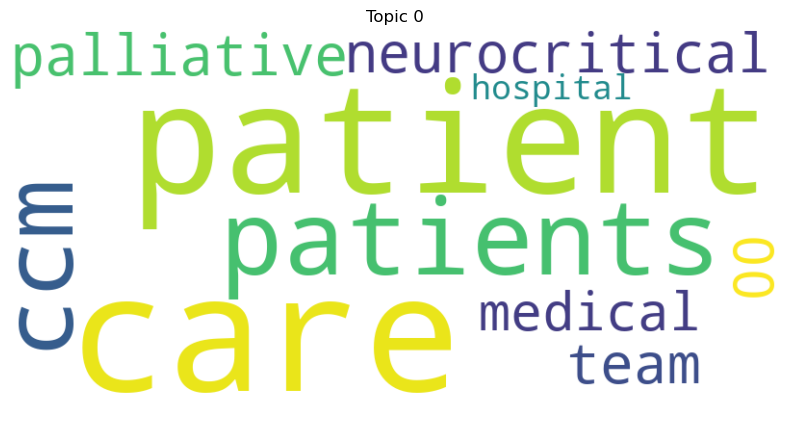
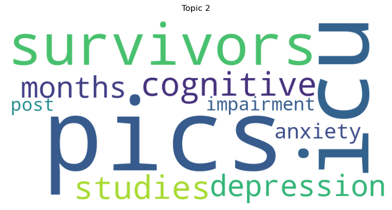

# NLP small project

CUNGI Pierre-Julien, MD, Military Teaching Hospital Sainte Anne, Toulon

# Abstract

**Background:** Systematic literature reviews in medicine are challengeg by exponentially growing publication volumes. Natural language processing (NLP) and large language models (LLMs) offer potential solutions to assist evidence synthesis.

**Objective:** To develop and validate a reproducible, semi-automated NLP pipeline for conducting systematic literature reviews, demonstrated through examination of family experience in neurocritical care settings.

**Methods:** We implemented a two-phase pipeline integrating PRISMA methodology with automated tools. Phase 1 combined PubMed API queries and Google Scholar web scraping (290 articles), followed by LLM-based screening using a local model (Qwen 4B) and manual validation, with automated storage in Zotero. Phase 2 applied dual analytical approaches: classical TF-IDF with K-means clustering on 36 abstracts, and transformer-based BERTopic with PubMed-specific BERT embeddings on 26 full-text articles. We analyses the main theme of each topic using a local LLM. Co-author network analysis assessed geographic distribution.

**Results:** The pipeline reduced the screening burden by 69% (from 290 to 89 articles) while maintaining expert oversight. Both methodologies independently identified three coherent thematic clusters: caregiver psychological impact (36-38%), quality of care and family-centred practices (38-50%), and Post-Intensive Care Syndrome (14-19%). Co-author analysis revealed substantial North American concentration, with Harvard Medical School-affiliated authors accounting for 39% of included articles, raising concerns about generalizability.

**Conclusion:** This work demonstrates the feasibility of accessible, reproducible NLP pipelines for medical literature synthesis, combining automation efficiency with human expertise. The convergence of classical and modern NLP approaches validates identified themes while highlighting the need for geographically diverse research in neurocritical care family experience.

**Keywords:** Natural language processing, systematic review, neurocritical care, family experience, large language models, topic modelling, BERTopic

## AI and Large Language Model Disclosure

## Generative AI Usage Statement

The authors acknowledge the use of artificial intelligence and large language models at multiple stages of this research project, as detailed below. All AI-generated content was critically reviewed, verified, and edited by the authors, who retain full responsibility for the accuracy and integrity of the work.

### Query Formulation and Optimization

Claude Sonnet 4.5 (Anthropic) was used to assist in the iterative development and optimization of search queries for PubMed and Google Scholar databases. The AI provided suggestions for Boolean operators, MeSH term selection, and query structure, which were subsequently validated through manual testing..

### Manuscript Preparation

Claude Sonnet 4.5 (Anthropic) was consulted during the manuscript writing process to assist with language refinement, structural organization, and translation from French to English for specific sections. All scientific content, interpretations, and conclusions represent the authors' own analysis and judgment.

### Technical Implementation

The code of the Jupyter Notebook used for NLP analysis was fully written by the authors, with AI assistance limited to debugging. The architecture of the NLP pipeline was entirely conceived by the author. Code for the NLP pipeline, connection to the API, web scraping, and LLM screening was written by the authors, aided by Claude Sonnet 4.5 (Anthropic) due to the task's complexity. AI assistance was utilised to optimise code, debug, and evaluate the consistency of the pipeline across different scripts. The complete codebase is available in the project repository for transparency and reproducibility.

### Data Analysis and Interpretation

All analyses, results interpretation, and scientific conclusions were performed independently by the authors.

### Declaration of Responsibility

The authors confirm that all AI-generated content was critically evaluated for accuracy, appropriateness, and alignment with scientific standards. The use of AI tools does not diminish the authors' responsibility for the integrity of the research or the validity of the conclusions presented.

# Introduction

We will base our methodology and the structure of our NLP pipeline for conducting this literature review on the **PRISMA** protocol (Preferred Reporting Items for Systematic Reviews and Meta-Analyses), which provides a solid methodological foundation even though we are not performing a meta-analysis:

1. **Preliminary study:** Definition of research questions and identification of search terms.
2. **Screening process:** Deduplication and intelligent filtering of abstracts by a local LLM according to user-defined criteria, followed by manual selection. Selected articles will be stored in a *Zotero* folder.
3. **Eligibility and quality assessment:** Application of strict inclusion/exclusion criteria to full texts and quality scoring.
4. **Data extraction and compilation:** Capture of bibliographic details and specific variables.

My approach is to conduct this work in two phases:

1. A first phase combining the preliminary study and screening process, which will constitute an initial screening (ETL pipeline: extract, transform, and load). The ultimate goal of this first pipeline is to store the results in a bibliographic management tool (in our case, *Zotero*) for easier reuse.
2. A phase focused on information processing to better understand and comprehend the data contained in the articles’ data and metadata. For this purpose, I will use a *Jupyter* notebook, which facilitates the integration of code, graphics, and markdown.

# Methodology

## Software used

**Python**  version 3.14

**Packages**  (all package in requirements.txt at the root of the GitHub project to facilitate the portability)

```
openai  # LLM API (use with LM Studio local server)
langchain # LLM optimization in python
biopython  # PubMed API access for bibliographic retrieval
requests  # HTTP library for API calls and web requests
beautifulsoup4  # HTML parsing (web scraping)
python-dotenv  # Secure environment variable management for credentials
pandas  # Tabular data manipulation and analysis
thefuzz  # Fuzzy string matching
pyzotero  # Zotero API integration 
pymupdf  # PDF text extraction
numpy  
scikit-learn  
matplotlib  
seaborn  
nltk # Natural language Toolkit
wordcloud  # Word cloud generation for text analysis
bertopic  # Topic modeling using transformer-based embeddings
sentence-transformers  # Semantic sentence embeddings via BERT
torch  # Deep learning framework

```

**LMStudio** ([https://lmstudio.ai/](https://lmstudio.ai/))

**Zotero** (Corporation for Digital Scholarship ) v 7.0.x n

**GitHub:** https://github.com/LeRustique/NLP_LitReview/ (send me a mail : [pjcungi@gmail.com](mailto:pjcungi@gmail.com) and i give you an acess)

# Phase 1: Preliminary Study, Extraction & Screening

## Preliminary Study:

### **Creation of the Search Query**

We decided to conduct a literature review on the following topic:

```python
Perception of Adult Neurocritical Care by Patients’ Families
```

We will use an LLM (Claude Sonnet 4.5 model) to help us formulate and optimize a PubMed & Google Scholar query, which are the primary search engines for peer-reviewed scientific articles.

We will not search the arXiv and medRxiv databases.

After several iterative optimization attempts, we obtained the following queries adapted for PubMed and Google Scholar.

The request (you can modify to realise your own research are localize in /request/ there is two markdown file, one for Pubmed and the second for Google Scholar.

PubMed:

> (“neurocritical care”[tiab] OR “neurointensive care”[tiab] OR “neuro-critical care”[tiab] OR “neurological intensive care”[tiab]) AND (“Family”[Mesh] OR family[tiab] OR families[tiab] OR relative[tiab] OR caregiver[tiab] OR “next of kin”[tiab]) AND (perception[tiab] OR experience[tiab] OR satisfaction[tiab] OR “Patient Satisfaction”[Mesh] OR attitude[tiab] OR view[tiab] OR perspective*[tiab] OR “Stress, Psychological”[Mesh] OR anxiety[tiab] OR burden[tiab]) NOT (pediatric OR paediatric OR PICU OR NICU OR neonatal OR child OR children OR infant OR newborn)
> 

Google Scholar:

> (“neurocritical care” OR “neurointensive care” OR “neuro ICU” OR “stroke unit” OR “traumatic brain injury”) AND (family OR families OR relatives OR caregivers) AND (perception OR experience OR satisfaction OR anxiety OR burden) -pediatric -paediatric -children -neonatal
> 

### **Testing of the Search Queries**

The queries we iteratively constructed were tested manually on PubMed and Google Scholar, and a rapid overview of the first abstracts was provided. When the query quality appeared satisfactory, the final query was used to proceed with extraction.

**On PubMed:** 90 articles identified, which is expected for a relatively specialised bibliographic search in this field.

**On Google Scholar:** 18,100 results (despite multiple query optimisation attempts)

I therefore decided to retrieve the first 200 results, which are naturally sorted by relevance.

## **Extraction Process**

Retrieval of results and metadata associated with abstracts

1. Use of the PubMed API via the *BioPython* package
2. Use of *web scraping* techniques in two stages for Google Scholar, which does not provide an API:
    1. First stage: Retrieval of overall information available on the search page by scraping the page using the *BeautifulSoup* package
    2. Second stage: Enrichment of results using the *CrossRef* API to enhance the limited results from scraping Google Scholar search pages.

We will attempt to retrieve as much data and metadata as possible for each publication. The PubMed API allows retrieval of most of this data directly. Enrichment of *scraped* data from Google Scholar using the *CrossRef* API will enable recovery of most of this data.

There is simples script implemented to test connection to PubMed API and Google Scholar Scrapping ( files **src/data_collection/pubmed_tester.py & src/data_collection/scholar_tester.py** ) 

The data extracted/scrapped are listed below :

### `Identification & Citation`

- *`PMID\\\\\\\\\\\\\\\*\\\\\\\\\\\\\\\* / \\\\\\\\\\\\\\\*\\\\\\\\\\\\\\\*DOI\\\\\\\\\\\\\\\*\\\\\\\\\\\\\\\* (unique identifiers)`
    - **`Complete title`**
        - **`Complete abstract`**
        - **`Authors`**
        - *`Journal/Source\\\\\\\\\\\\\\\*\\\\\\\\\\\\\\\* (full name)`
        - **`Publication year`**
        - **`Volume, Issue, Pages`**
        - *`URL/Link\\\\\\\\\\\\\\\*\\\\\\\\\\\\\\\* to the article`
        
        ### `Methodology`
        
        - *`Publication type\\\\\\\\\\\\\\\*\\\\\\\\\\\\\\\* (Article, Review, Meta-Analysis, etc.)`
        - *`Study type\\\\\\\\\\\\\\\*\\\\\\\\\\\\\\\* (quantitative, qualitative, mixed)`
        - *`MeSH Terms\\\\\\\\\\\\\\\*\\\\\\\\\\\\\\\* (PubMed only - very useful for classification)`
        - *`Keywords\\\\\\\\\\\\\\\*\\\\\\\\\\\\\\\* (author keywords)`
        
        ### `Access`
        
        - *`Open Access status\\\\\\\\\\\\\\\*\\\\\\\\\\\\\\\* (OA)`
        - *`PMC link\\\\\\\\\\\\\\\*\\\\\\\\\\\\\\\* (if available - free full text)`
        - *`PDF link\\\\\\\\\\\\\\\*\\\\\\\\\\\\\\\* (Google Scholar)`
        
        ## `Other`
        
        - **`Country/Study location`**
        - **`Publication language`**
        - *`Online publication date\\\\\\\\\\\\\\\*\\\\\\\\\\\\\\\* (edat) vs \\\\\\\\\\\\\\\*\\\\\\\\\\\\\\\*publication date\\\\\\\\\\\\\\\*\\\\\\\\\\\\\\\* (pdat)`
        - *`Citation count\\\\\\\\\\\\\\\*\\\\\\\\\\\\\\\* (Google Scholar)`
        - *`Funding\\\\\\\\\\\\\\\*\\\\\\\\\\\\\\\* (if mentioned)`
        - *`Conflicts of interest\\\\\\\\\\\\\\\*\\\\\\\\\\\\\\\* (if mentioned)`

## Procedure for Identifying Articles of Interest

1. Article selection using automated methods

We will perform an initial “automated” article selection using a local LLM to verify whether the abstract themes correspond to our search criteria. For this purpose, we will use a structured “zero-shot” prompting technique in markdown, explicitly requesting a structured JSON output to improve performance, and *LMStudio* as a local server with a generalist LLM (Qwen4b).

```markdown
 You are a research assistant screening papers for a systematic review.

# CRITERIA:

## Inclusion & Exclusion Criteria

### Inclusion Criteria
-**Population**: Adult patients (>= 18 years) admitted to Neuro-Intensive Care Unit (Neuro-ICU) or suffering from severe acute brain injury (TBI, Stroke, Subarachnoid Hemorrhage).
-**Subject**: Family members, relatives, or caregivers of these patients.
-**Focus**: Perception, experience, satisfaction, needs, anxiety, depression, burden, or psychological impact.
-**Study Type**: Qualitative, Quantitative, or Mixed Methods.
-**Language**: English.

### Exclusion Criteria
-**Population**: Pediatric patients (< 18 years), Neonatal ICU.
-**Focus**: Purely clinical outcomes (mortality, ICP management) without family perspective.
-**Study Type**: Case reports (n < 5), Editorials/Commentaries (unless systematic review).

# PAPER:
        Title: {title}
        Abstract: {abstract}

## TASK:
   Decide if this paper should be INCLUDED or EXCLUDED based on the criteria.
   Explain your reasoning briefly.

## OUTPUT FORMAT:
    Return a single JSON object:
    {{
      "included": true,
      "reason": "Brief explanation..."
    }}
```

1. **Manual article selection**

After this initial pre-selection performed by an LLM, which eliminates off-topic articles, we conduct a second manual selection using the terminal to display each abstract and request whether or not the clinician conducting the literature review wishes to retain the article.

## Storage of Selected Articles in Zotero

We can use the *pyzotero* package https://github.com/urschrei/pyzotero & its documentation [https://pyzotero.readthedocs.io/](https://pyzotero.readthedocs.io/) to store the references found in Zotero and potentially retrieve the full versions for those where this is possible (open access or via the Aix-Marseille University proxy).

### Retrieval of Full Articles

Using Zotero and Aix-Marseille University’s access to various journals, I wretrieved 26 full-text articles fromthe 31 identified abstracts.

## How to launch the extraction, automatic screening, selection of articles & storage in a new collection in Zotero.

All the files needed to reproduce the pipeline are on the GitHub repository.

The full process of extraction can be launch using the [main.py](http://main.py) files in /src.

1. Create a Zotero API Key [https://www.zotero.org/settings/keys](https://www.zotero.org/settings/keys) 
2. Set up & start LMStudio ([https://lmstudio.ai/](https://lmstudio.ai/)), download a generalist LLM adapted to your system (Qwen 3 VI 4B used for this work), & activate the server. ([https://lmstudio.ai/docs/developer/core/server](https://lmstudio.ai/docs/developer/core/server)) 
3. Modify the **.env**   with your email address (not mandatory, but accelerates the PubMed API ) & your Add Zotero API credentials (Library ID, which is your user number & Api Key). The parameters set for LMStudio are “default”.
4. Modify the queries files in /requests  for PubMed & Google Scholar
5. Modify the [criteria.md](http://criteria.md) file which specifies the criterias used by the local LLM to do a pre-screening of the 
6. Launch **main.py,**  and he script will ask you for a “Collection Name” to add to Zotero.

The full application flow is detailled on GitHub in **application_flow.md**

# Phase 2: Comprehensive Analysis

## Cleaning and Pre-processing of PDF Files

### Abstract Corpus

We applied traditional Natural Language Processing (NLP) methodology with:

- Use of the NLTK (Natural Language Toolkit) package for tokenisation and lemmatisation
- Stopword removal using the sklearn package
- Calculation of a TF-IDF (Term Frequency-Inverse Document Frequency) matrix for the 36 abstract corpus
- Use of a K-means clustering algorithm (Sklearn)
- Visual analysis using wordclouds, multidimensional scatterplots (PCA)
- Secondary objective analysis : Co-Author networkx.

### Full-Text Corpus

Methodology used on the 26 full-text articles:

- Conversion of PDF files to raw text using PyPDF
- Text body extraction using Regular Expressions (RegEx). Normalization of vertical, horizontal, and non-breaking spaces, removal of empty lines. Detection of article beginning and end using standardized terms.
- Removal of URLs, DOIs, line break markers (numerous due to columnar text).
- We plan to attempt analysis without stopword removal and lemmatization, as these do not improve BERT embedding performance.
- We use the BERTopic thematic analysis package with a BERT model specifically trained on PubMed (NeuML/pubmedbert-base-embeddings). [https://maartengr.github.io/](https://maartengr.github.io/).
- BERTopic is a pipeline chaining several sequential steps:
    1. *Sentence Tokenizer* associated with a BERT Embedding.
    2. Dimensionality reduction performed by a UMAP model or PCA analysis
    3. Clustering performed by an HDBSCAN or KNN model
    4. A vectorizer (CountVectorizer)
    5. Application of a c-TF-IDF algorithm on each generated cluster to identify the most frequent terms.

Note: I deliberately chose different methodologies for the two analyses to explore various NLP techniques. Methodological rigor would have required using comparable methodologies in both cases, or applying both different methodologies to both corpora.

### Cluster analysis

After defining the clusters on the full-text corpus, we conducted a cluster-level analysis to identify the sub-themes addressed within each cluster using a zero-shot strategy (prompt in markdown, force the ouptut in JSON)  with a  local large language model (Qwen‑4B). The prompt used for this task is detailled below.

```python
You are an expert in scientific literature analysis.

**CORPUS TO ANALYZE:**
{corpus_text}

**INSTRUCTIONS:**
1. Carefully read the corpus above
2. Identify 3 to 5 main themes (no more than 5)
3. For each theme:
   - Provide a short title (3-6 words maximum)
   - Write a clear description (15-30 words)
   - List 3-5 relevant key concepts
4. Summarize the main message of the corpus in 1-2 sentences (20-40 words)
5. Each article is separated by \n\n--- NEW ARTICLE ---\n\n

**IMPORTANT RULES:**
- Base your analysis ONLY on the provided corpus
- Do not mention external information
- Use precise scientific vocabulary
- Remain factual and objective

**RESPONSE FORMAT:**
Respond in valid JSON only, with no text before or after. Exact structure:
{{
  "thematic_axes": [
    {{
      "article analysed:"Number of articles in the cluster"
      "theme": "theme title",
      "description": "short and precise description",
      "key_concepts": ["concept1", "concept2", "concept3"]
    }}
  ],
  "main_message": "synthesis in a short paragraph"
}}

JSON RESPONSE:
```

## How to use the abstract & full text analysis.

If you want to transform a Zotero JSON file into .csv to use it with the script you can use the json_to_csv.py script in /src.( You can use too the .csv produced by the above pipeline).

**Abstract analysis:** Jupyter Notebook for Abstract analysis is in *src\analysis\analysis_abstract_article.ipynb.*

# Results:

### Population

      **Abstracts included**: 36

**Year (median [min-max] ):** 2020 [1996 - 2025]

**Distribution of included abstract**

1990s: 2 (5.6%)
2000s: 2 (5.6%)
2010s: 11 (30.6%)
2020s: 20 (55.6%)

**Study type:**

Unspecified: 13 (36.1%)
Qualitative: 9 (25.0%)
Cohort/Longitudinal: 6 (16.7%)
Retrospective: 2 (5.6%)
Cross-Sectional/Survey: 2 (5.6%)
RCT: 2 (5.6%)
Pilot: 1 (2.8%)
Review: 1 (2.8%)

## Flow Chart



### Abstract Analysis

We applied the TF-IDF methodology with max_features=200, min_df = 2, max_df = 0.8, ngram_range = (1,3) & token_pattern = r’a-zA-Z]{3,}. The top 20 lemmas present in the corpus are represented in Figure 2.



Fig 2. Top 20 lemmas in the abstract corpus

We applied a K-means algorithm and identified 3 unbalanced clusters (Silhouette score in Figure 3) - wordclouds of these clusters in Figure 4.



Fig 3. Silhouette score

---

**Cluster 0 (13 abstracts):***Related words:* anxiety, sabi, caregiver, injury, qol, anxiety symptom, depression, mental, brain injury, brain

---

**Cluster 1 (5 abstracts):***Related words:* pics, survivor, icu, icu survivor, illness, critical, pics pics, review, health, syndrome

---

**Cluster 2 (18 abstracts):***Related words:* satisfaction, patient satisfaction, outcome, increased, involvement, neurocritical, unit, period, interaction, nurse

---



Figure 4 Wordcloud for the 3 identified clusters

We examined the distribution of clusters regarding article publication dates (results are in Figure 5).



Fig 5. Cluster & Date of publication

The 3 journals with more than 1 article on the topic are “Neurocritical Care” with 7 (19.4%) articles, “The Journal of Neuroscience Nursing” with 3 articles (8.3%) & “Cureus” with 2 articles (5.6%).

Mean authors per article is 6.2 and the top 10 authors are:

| **Rank** | **Author** | **Articles** |  |
| --- | --- | --- | --- |
| 1 | Vranceanu Ana-Maria | 7 | Harvard Medical School |
| 2 | Rosand Jonathan | 4 | Harvard Medical School |
| 3 | Presciutti Alex | 3 | Harvard Medical School |
| 4 | Samuels Owen | 2 |  |
| 5 | Lin Ann | 2 |  |
| 6 | Zhang Qiang | 2 |  |
| 7 | Reichman Mira | 2 |  |
| 8 | Muehlschlegel Susanne | 2 |  |
| 9 | Kreitzer Natalie | 2 |  |
| 10 | Foreman Brandon | 2 |  |

### Full-Text Analysis

The thematic analysis using BERTopic identified 3 main topics in the corpus : (repartitions  and wordcloud in figures 5,6,7 & 8)

| Topic | Count | Name | **Representation** |
| --- | --- | --- | --- |
| -1 | 1 | -1_session_vsma_virtual_wright | [session, vsma, virtual, wright, sessions, mah... |
| 0 | 10 | 0_caregivers_family_patients_anxiety | [caregivers, family, patients, anxiety, sympto... |
| 1 | 10 | 1_care_patient_patients_ccm | [care, patient, patients, ccm, palliative, tea... |
| 2 | 5 | 2_pics_survivors_icu_cognitive | [pics, survivors, icu, cognitive, studies, mon... |



Fig 5. Most Frequent word by clusters



Fig 6. Topic 0 WordCloud


Fig 7. Topic 1 WordCloud



Fig 8. Topic 2 WordCloud

*Co-author’sanalysis :* We create a network of co-authors and search for  “communities” using Louvain algorithms. The graphic show the network of the Top 30 authors and their communities.


### Subtopic analysis with Local LLM

Sub thematic analysis from Topic 0 :  0_caregivers_family_patients_anxiety

| Articles | Theme | Description | Key Concepts |
| --- | --- | --- | --- |
| 6 | Psychological Distress in Neurocritical Care | High rates of depression, anxiety, and PTSD in patients and caregivers following neurological injuries, impacting quality of life. | depression, anxiety, PTSD, quality of life |
| 4 | Dyadic and Family-Centered Interventions | Interventions targeting both patients and caregivers to build resilience, prevent chronic emotional distress, and involve families in care. | dyadic intervention, mindfulness, coping skills, family involvement |
| 2 | Caregiver Burden and Mental Health | Caregivers experience significant burden, depression, and anxiety, influenced by factors like personality traits and caregiving demands. | caregiver burden, depression, mental health trajectories, personality traits |
| 4 | Communication and Decision-Making | Challenges in surrogate decision-making, family satisfaction, and the need for effective communication in critical care settings. | shared decision-making, family satisfaction, communication, surrogate decision-makers |

Sub-thematic analysis of topic 1 :  1_care_patient_patients_ccm

| Articles  | Theme | Description | Key Concepts |
| --- | --- | --- | --- |
| 4 | Palliative Care Integration | Integration of palliative care in neurocritical settings to manage symptoms, facilitate goals-of-care conversations, and support families. | goals-of-care conversations, symptom management, family psychosocial support, end-of-life care |
| 4 | Family-Centered Communication | Strategies to enhance family involvement through cultural mediation, unit redesign, and improved communication frameworks. | cultural mediation, family-centered design, communication frameworks, bereavement support |
| 4 | Neurocritical Care Team Impact | Benefits of dedicated neurointensivists and specialized teams on clinical outcomes, quality metrics, and patient satisfaction. | neurointensivist, quality metrics, length of stay, patient satisfaction |
| 3 | Ethical Decision-Making Challenges | Addressing prognostic uncertainty, informed consent, and ethical dilemmas in life-sustaining treatment decisions for neurocritical patients. | prognostic uncertainty, retrospective consent, life-sustaining treatment, surrogate decision-making |

Sub-thematic analysis of topic2 

Voici le tableau en markdown :

| Articles  | Theme | Description | Key Concepts |
| --- | --- | --- | --- |
| 4 | Definition and Components of PICS/PICS-F | PICS involves physical, cognitive, and mental impairments in ICU survivors; PICS-F refers to psychological distress in their relatives. | Post-intensive care syndrome, PICS-F, Multidimensional impairments, Anxiety, Depression |
| 4 | Mental Health Impact on Quality of Life | Mental components like anxiety, depression, and PTSD significantly reduce quality of life for both survivors and families. | Quality of life, Psychological sequelae, Anxiety, Depression, PTSD |
| 3 | Risk Factors and Clinical Challenges | Risk factors include delirium, sedation, and ICU length of stay; neurocritical care poses challenges due to overlapping injuries. | Delirium, Sedation, ICU length of stay, Neurocritical care, Acute brain injury |
| 3 | Communication and Integrated Care Strategies | Empathetic communication, A2F bundle use, and follow-up clinics are essential for managing PICS and supporting recovery. | Empathy, A2F bundle, ICU recovery clinics, Dyadic interventions, Shared decision-making |

# Discussion

### Finding

**Thematic analysis :** Our analyses identified three major  clusters that are consistenct across both the abstract analysis (TF-IDF/K-means methodology) and full-text analysis (BERTopic/BERT embeddings). This convergence between classical NLP techniques and modern transformer-based methods strengthens confidence in the identified thematic structure 

**Cluster 1: Psychological Impact on Caregivers and Family Members** represent approximately 36% of the abstract corpus (13/36 articles) and 38% of the full-text corpus (10/26 articles), emerged as a central theme in the literature. This cluster is characterized by terms including "anxiety," "depression," "caregiver," "burden," "PTSD," "quality of life," and "mental health." 

This theme reflects t that severe acute brain injury constitutes a *dyadic crisis* affecting both patients and their families. The sub-thematic analysis revealed four distinct sub clusters within this cluster:

 The high prevalence of psychological distress, including depression, anxiety, and post-traumatic stress disorder in both patients and caregivers following neurological injuries;

The development and evaluation of dyadic interventions targeting resilience-building in patient-caregiver pairs;

The burden of caregiving and its longitudinal mental health trajectories

challenges in surrogate decision-making and family-clinician communication during critical illness.

These findings align with critical care literature documenting psychological morbidity among family members of ICU patients. The neurocritical care context presents unique challenges: the sudden onset of catastrophic events, the uncertain prognosis of acute brain injury, and the frequent need for surrogate decision-making regarding life-sustaining treatments create a particularly stressful environment for families. The preponderance of articles addressing anxiety and depression suggests these represent the most commonly studied outcomes, though this may reflect measurement accessibility rather than clinical importance.

**Cluster 2: Quality of Care and Family-Centered Practices represent** 50% of the abstract corpus (18/36 articles) and 38% of the full-text corpus (10/26 articles), focuses on the quality of neurocritical care delivery and family involvement in the care process. This cluster is characterized by terms such as "satisfaction," "patient satisfaction," "outcome," "involvement," "neurocritical unit," "nurse," "communication," and "interaction." Sub-thematic analysis of this cluster identified four key areas:

integration of palliative care principles in neurocritical care settings, including goals-of-care conversations and symptom management

family-centered communication strategies and cultural mediation

Impact of specialized neurocritical care teams and dedicated neurointensivists on clinical outcomes and quality metrics

Ethical challenges in decision-making, particularly regarding prognostic uncertainty and informed consent for life-sustaining treatments.

The emphasis on satisfaction metrics and family involvement reflects a paradigm shift in critical care medicine toward patient- and family-centered care models. Family satisfaction represents a complex, multidimensional construct influenced by communication quality, care processes, outcomes, and expectations. Satisfaction may not always align with other quality indicators or with what families retrospectively identify as important. This cluster suggest that effective information exchange and shared decision-making represent modifiable factors that can improve family experience independent of clinical outcomes.

**Cluster 3: Post-Intensive Care Syndrome (PICS and PICS-F) is**  our smallest itopic  (14% of abstracts, 19% of full-text articles), addresses Post-Intensive Care Syndrome (PICS) in survivors and Post-Intensive Care Syndrome-Family (PICS-F) in their relatives. This cluster is characterized by terms including "PICS," "survivors," "ICU survivor," "cognitive impairment," "illness," and "syndrome."
The small size of the cluster reflects the recency of PICS as a formalized concept  representing an emerging area of research interest. Sub-thematic analysis revealed four components: 

The definition and multidimensional nature of PICS/PICS-F, encompassing physical, cognitive, and mental health impairments

The substantial impact of these psychological sequelae on quality of life for both survivors and families

Risk factors including delirium, sedation practices, and ICU length of stay, with particular challenges in neurocritical care due to overlapping acute brain injury effects;

integrated care strategies including ICU follow-up clinics and dyadic interventions

The identification of PICS-F as a cluster highlights a recent and important evolution in critical care medicine: the recognition that family members represent "hidden patients" who may experience lasting psychological consequences from a relative's critical illness. 

### methodology analysis

**Efficiency of Automated LLM-Based Screening :** the two-stage screening approach (automated local LLM pre-screening followed by manual validation) successfully reduced the initial corpus from 290 deduplicated articles to 89 potentially relevant articles (69% reduction), which were then manually refined to 36 included abstracts. This represents a substantial reduction in manual screening while maintaining the rigor of human expert judgment in final selection decisions.

**Conception strengh:** Deployment of a local LLM (Qwen 3 4B in LMStudio) ensured data confidentiality and eliminated ongoing API costs, making the approach sustainable for researchers with limited budgets and limited computational power. The modular design with separate query files, criteria documents, and configurable parameters enables easy modification and adaptation to different research questions.

**Limitation:** We did not  calculate performance metrics (sensitivity, specificity, positive/negative predictive values) for the LLM screening step, which would require manual screening of the entire corpus as a gold standard and can’t be done in this small project. The zero-shot prompting approach, while accessible and adapted to a limited computationnal power, may underperform compared to few-shot learning on medical literature screening tasks. Additionally, the performance of a 4-billion parameter model (Qwen 4B) is extremely limited if we compare to the 24B or 70B parameters models.

**Classical approach  (TF-IDK + Kmeans):**  high interpretability of TF-IDF weights. The ability to control and reproduce  preprocessing steps (lemmatization, stopword removal, n-gram ranges) provides transparency in how the algorithm "sees" the text. The main limitation is that TF-IDF captures term frequency but not semantic meaning.

**Transformer approach (BERTopic with PubMed Specific Embeding) :**   BERT embeddings capture contextual semantic meaning, enabling the model to recognize that "stroke" and "cerebrovascular accident" represent the same concept despite different vocabulary. The use of embeddings pre-trained specifically on PubMed literature ensures domain-appropriate semantic representations. BERTopic's hierarchical approach (BERT embeddings > UMAP dimensionality reduction > HDBSCAN clustering > c-TF-IDF topic representation) allows data-driven cluster discovery without pre-specifying cluster numbers.

### Fairness

The co-author network rapid analysis revealed  geographic concentration in the included literature. Ana-Maria Vranceanu appeared as an author on 7 of 36 articles (19.4%), with frequent co-authorship with Jonathan Rosand (4 articles) and Alex Presciutti (3 articles), all affiliated with Harvard Medical School. This geographic concentration raises important questions about the generalizability of findings and recommendations derived from this literature which is highly linked to cultural practice.

## Conclusion

We identify three main thematic clusters in our litterature review : the psychological impact on caregivers and families, the quality of care and family-centered practices, and the emerging concept of Post‑Intensive Care Syndrome in survivors and relatives. The convergence of classical (TF‑IDF/K‑means) and transformer-based (BERTopic) approaches reinforces the robustness of this thematic structure and supports the validity of the findings.

The predominance of caregiver psychological distress and family-centered care underscores that severe acute brain injury constitutes a *dyadic crisis*, in which family members are essential partners in care and vulnerable to long-term mental health consequences. While PICS and PICS‑F remain less represented, their identification reflects a growing recognition of families as “hidden patients,” particularly relevant in neurocritical care where prognostic uncertainty and surrogate decision-making are pervasive.

Methodologically, the LLM-assisted screening strategy proved efficient and feasible for small-scale projects, though its performance warrants further validation with larger models and formal metrics. Finally, the geographic concentration of authorship raises concerns about generalizability, emphasizing the need for more diverse and cross-cultural research to inform equitable, family-centered neurocritical care practices.

[image](https://www.notion.so/image-2ee77e6b6892804ea627dc0a77e1bf29?pvs=21)