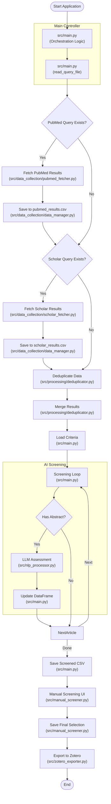

# Application Flow Scheme

```mermaid
graph TD
    Start([Start Application]) --> MainLogic
    
    subgraph "Main Controller"
    MainLogic["src/main.py<br/>(Orchestration Logic)"]
    LoadQueries["src/main.py<br/>(read_query_file)"]
    end
    
    MainLogic --> LoadQueries
    LoadQueries --> CollectPubMed{PubMed Query Exists?}
    
    CollectPubMed -- Yes --> FetchPub["Fetch PubMed Results<br/>(src/data_collection/pubmed_fetcher.py)"]
    FetchPub --> SavePub["Save to pubmed_results.csv<br/>(src/data_collection/data_manager.py)"]
    SavePub --> CollectScholar
    CollectPubMed -- No --> CollectScholar
    
    CollectScholar{Scholar Query Exists?}
    CollectScholar -- Yes --> FetchSch["Fetch Scholar Results<br/>(src/data_collection/scholar_fetcher.py)"]
    FetchSch --> SaveSch["Save to scholar_results.csv<br/>(src/data_collection/data_manager.py)"]
    SaveSch --> Dedupe
    CollectScholar -- No --> Dedupe
    
    Dedupe["Deduplicate Data<br/>(src/processing/deduplicator.py)"] --> Merge["Merge Results<br/>(src/processing/deduplicator.py)"]
    
    Merge --> LoadCriteria["Load Criteria<br/>(src/main.py)"]
    LoadCriteria --> NLPLoop
    
    subgraph "AI Screening"
    NLPLoop["Screening Loop<br/>(src/main.py)"]
    NLPLoop --> CheckAbs{Has Abstract?}
    CheckAbs -- Yes --> LLMScreen["LLM Assessment<br/>(src/nlp_processor.py)"]
    LLMScreen --> MarkResult["Update DataFrame<br/>(src/main.py)"]
    end
    
    MarkResult --> NextArticle
    CheckAbs -- No --> NextArticle
    NextArticle -->|Next| NLPLoop
    
    NextArticle -->|Done| SaveScreened["Save Screened CSV<br/>(src/main.py)"]
    
    SaveScreened --> ManualHuman["Manual Screening UI<br/>(src/manual_screener.py)"]
    ManualHuman --> FinalSel["Save Final Selection<br/>(src/manual_screener.py)"]
    
    FinalSel --> ExportZotero["Export to Zotero<br/>(src/zotero_exporter.py)"]
    ExportZotero --> End([End])
```
